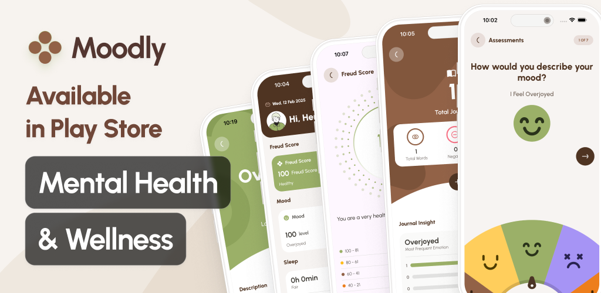

# Moodly

Moodly é um aplicativo para monitoramento de humor, sono e estresse, funcionando como um diário
pessoal. Os dados são armazenados localmente, garantindo privacidade ao usuário.

## Recursos

- Registro de humor, sono e estresse
- Armazenamento local dos dados
- Interface intuitiva e amigável
- Gráficos e insights sobre seus estados ao longo do tempo

## Tecnologias Utilizadas

- **Kotlin Multiplatform (KMP)**: Desenvolvimento para Android e iOS com Compose Multi-Platform
- **Jetpack Compose**: Interface moderna e declarativa
- **Room Database**: Armazenamento local seguro
- **Kotlin Coroutines**: Para operações assíncronas eficientes
- **MVI**: Arquitetura organizada e escalável
- **Testes Unitários**: Garantia de qualidade e confiabilidade

## Como Instalar

O Moodly está disponível na Google Play
Store. [Clique aqui para baixar](https://play.google.com/store/apps/details?id=com.joohnq.moodapp)

## Contribuição

O código-fonte é de propriedade exclusiva de João Henrique e não pode ser modificado ou
redistribuído.
No entanto, você pode ajudar divulgando o aplicativo e compartilhando feedback!

## Licença

Este projeto está licenciado sob a **Licença Proprietária**. O código-fonte e o aplicativo são de
propriedade exclusiva de João Henrique.

Você NÃO tem permissão para modificar, distribuir ou criar trabalhos derivados do código-fonte ou do
aplicativo sem permissão expressa.

Para mais detalhes, consulte o arquivo [LICENSE](./LICENSE).

Todos os direitos reservados.

## Contato

Desenvolvido por **João Henrique**

- LinkedIn: [Seu Perfil](https://www.linkedin.com/in/joohnq/)
- E-mail: [Seu E-mail](mailto:joaohenriquess3287@gmail.com)

