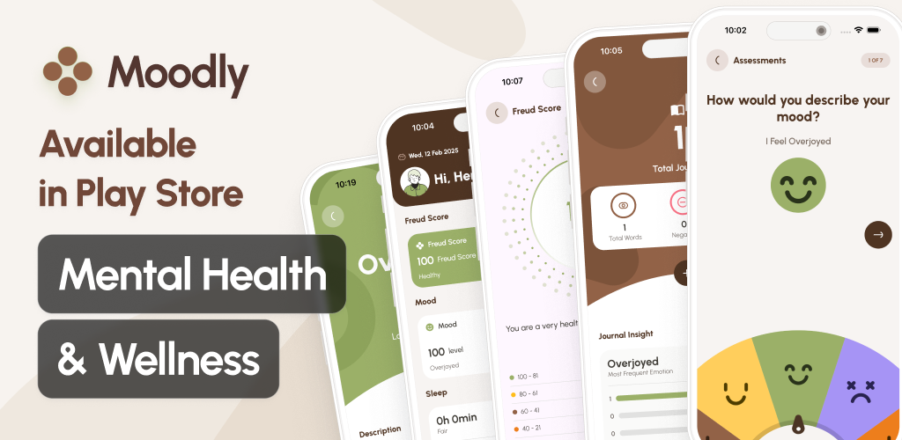

# Moodly

**Moodly** é um aplicativo para monitorar seu **humor**, **sono** e **estresse**, funcionando como um diário pessoal. Todos os dados são armazenados **localmente**, garantindo total **privacidade** ao usuário. 🔒

## 🚀 Recursos

- 🎭 Registro de humor, sono e estresse  
- 💾 Armazenamento local dos dados  
- 🤝 Interface intuitiva e amigável  
- 📊 Gráficos e insights sobre seus estados ao longo do tempo  

## 🛠️ Tecnologias Utilizadas

- **Compose Multiplatform (CMP)**: desenvolvimento para Android e iOS  
- **Jetpack Compose**: interface moderna e declarativa  
- **SQLDelight**: armazenamento local seguro  
- **Kotlin Coroutines**: operações assíncronas eficientes  
- **MVI**: arquitetura organizada e escalável  

## 📥 Como Instalar

Moodly está disponível na Google Play Store.

## 🤝 Contribuição

O código-fonte é de **propriedade exclusiva de João Henrique** e não pode ser modificado ou redistribuído.  
Mas você pode ajudar **divulgando o app e enviando feedbacks!**  

## 📄 Licença

Este projeto está licenciado sob **Licença Proprietária**.  
Você **NÃO** tem permissão para modificar, distribuir ou criar trabalhos derivados do código-fonte ou do app sem autorização expressa.

Para mais detalhes, consulte o arquivo [LICENSE](./LICENSE).

**Todos os direitos reservados.**
